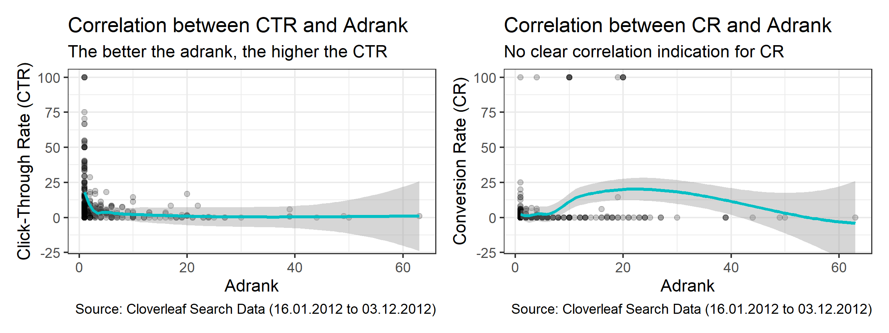
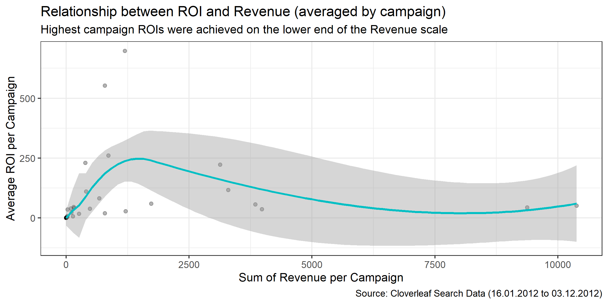
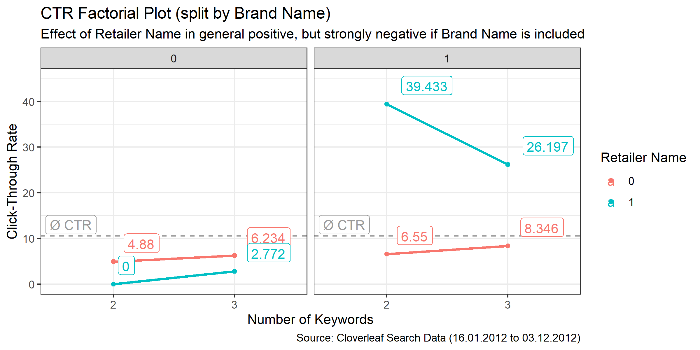
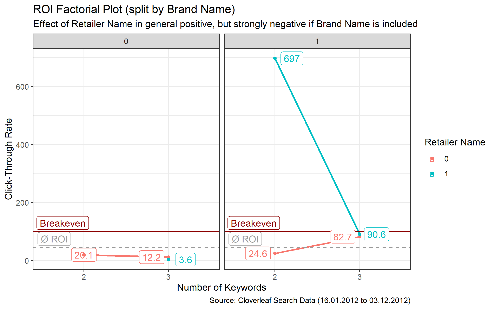

Goals
-------------------

The aim of this marketing project was to evaluate a clients search engine effectiveness and to build recommendations for future keyword optimization. Despite the attractiveness of Excel for those type of quick analysis, I created an R script that helps to clean, analyse, and wrangle typical search engine data with low effort. 

The result is a very facilitated search engine analysis, which leverages non-statistical techniques, such as Factorial Analyses etc. Furthermore, concerns with the given data and genelral case set-up are discussed in the Appendix of the report.

Unfortunately, the data availability per sub-group is to low to build any sophisticated or advances models in order to classify strategies or to predict future ad ranks, CTR, CR or even ROI.

Samples from the Analysis 
-------------------

